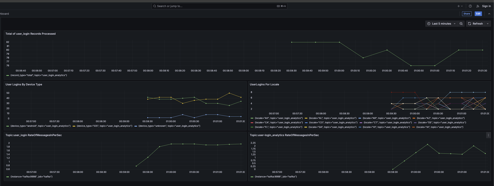

# Fetch


## Executing the Project

### **Prerequisites**:
- docker and docker-compose installed.
- clone this repo and navigate to the repo's root directory 'Fetch'

### **Start the Pipeline**:
```bash
sudo docker compose up --detach
or
sudo docker-compose up --detach
```

### **Access Services**:
- **Prometheus**: [http://localhost:9090](http://localhost:9090)
- **Grafana**: [Dashboard](http://localhost:3000/d/fetch/fetch-dashboard?orgId=1&from=now-15m&to=now&timezone=browser) 
- **Sample Dashboard**: Metrics should begin appearing approximately 3 minutes after the containers start. 


### **Stop the Pipeline**:
```bash
sudo docker-compose down
or 
sudo docker compose down
```

---


This creates the following containers in the Docker-Compose stack named "Fetch":

1. **kafka-1**: Kafka broker.
2. **my-python-producer-1**: Generates user login events.
3. **zookeeper-1**: Coordinates the Kafka cluster.
4. **prometheus**: Monitors the pipeline and scrapes metrics.
5. **grafana**: Visualizes Prometheus metrics in dashboards.
6. **kafka-consumer-1**: A consumer application that polls the `user-login` topic every 20 seconds. Sends aggregations to `user_login_analytics` kafka topic and prometheus.


Sample for records produced by  'my-python-producer-1' 
```
{
  "user_id": "424cdd21-063a-43a7-b91b-7ca1a833afae",
  "app_version": "2.3.0",
  "device_type": "android",
  "ip": "199.172.111.135",
  "locale": "RU",
  "device_id": "593-47-5928",
  "timestamp": "1694479551"
}
```


---


# **Overview of Analytics Pipeline**

## Description

The **Fetch** application is a Kafka-based data processing pipeline designed to generate, process, and monitor user login events. It uses Kafka topics to handle the ingestion, aggregation, and publication of analytics data, with integrated monitoring tools like Prometheus and Grafana for real-time visualization and performance insights.


## **Key Components**
1. **Kafka and Zookeeper**:
   - Manages the message queue and coordinates distributed components.
   - Provides durability and scalability for message streams.

2. **Producer** (`my-python-producer`):
   - Generates user login events and pushes them to the `user-login` Kafka topic.

3. **Consumer** (`kafka-consumer`):
   - Aggregates data from the `user-login` topic and produces analytics to the `user_login_analytics` topic.
   - Sends metrics (e.g., device type and locale counts) to Prometheus for monitoring.

4. **Prometheus and Grafana**:
   - Prometheus scrapes metrics from the consumer to monitor pipeline performance.
   - Grafana visualizes metrics and provides real-time dashboards.
   
### Key Features:
1. **Data Generation**:
   - The producer simulates user login events and publishes them to the Kafka topic `user-login`.

2. **Data Processing**:
   - A consumer application polls the `user-login` topic every 20 seconds.
   - Aggregates data on:
     - `locale`: Tracks the geographic origin of logins.
     - `device_type`: Categorizes logins by device type (e.g., mobile, desktop).
     - `total records`: Computes the total number of login events.
   - The aggregated results are published to the Kafka topic `user-login-analytics`.

3. **Monitoring and Visualization**:
   - Aggregated metrics are exposed as Prometheus metrics, which are scraped and stored for analysis.
   - Grafana dashboards visualize these metrics, offering insights into:
     - Login trends by device type.
     - Geographic distribution of user logins.
     - Overall system throughput and performance.

### Prometheus Metrics
Prometheus collects the following key metrics from the consumer application:
- `device_type_count`: Tracks the number of events for each device type.
- `locale_count`: Monitors the number of events by geographic locale.
- `total_count`: Measures the total number of processed events.

### Visualization with Grafana
The Grafana dashboard provides detailed analytics and trends:
- Accessible at: [Grafana dashboard](http://localhost:3000/d/fetch/fetch-dashboard?orgId=1&from=now-15m&to=now&timezone=browser)
- Displays metrics like:
  - Event processing rates.
  - Device type distribution.
  - Geographic distribution of user logins.

### **Key Metrics Exposed**:
1. **`device_type_count`**:
   - Labels: `device_type`, `topic`.
   - Tracks the number of events by device type.

2. **`locale_count`**:
   - Labels: `locale`, `topic`.
   - Tracks the number of events by locale.

3. **`total_count`**:
   - Labels: `record_type`, `topic`.
   - Tracks the total number of processed events.

---  


## **Data Flow**
1. **Event Generation**:
   - The producer publishes user login events to the Kafka topic `user-login`.

2. **Consumption and Aggregation**:
   - The consumer reads events from `user-login`, processes them in batches, and computes aggregations (e.g., device type counts, locale counts).
   - Aggregated data is sent to the `user_login_analytics` topic.

3. **Monitoring**:
   - Metrics (e.g., `device_type_count`, `locale_count`, and `total_count`) are exposed to Prometheus via a custom HTTP server.

4. **Visualization**:
   - Grafana displays pipeline performance metrics (e.g., processing rates, event counts) on dashboards.


### Use Case Scenarios
1. **Real-Time Analytics**:
   - Monitor user login activity in real-time to identify peak usage periods or geographic patterns.
   
2. **Scalability Testing**:
   - Evaluate system performance under high load conditions using simulated events.

3. **System Health Monitoring**:
   - Track pipeline performance and detect issues (e.g., consumer lag, data loss) using Prometheus metrics.


---


## Changes Made to the Provided `docker-compose.yml`

### 1. **Added JMX Kafka Monitoring**
   - Integrated a **JMX Exporter** into the Kafka broker to monitor Kafka topics and broker performance.

### 2. **Implemented Kafka-Consumer Application**
   - Developed a `kafka-consumer` application that:
     - Polls records from the `user-login` topic.
     - Computes aggregations (e.g., counts by `device_type` and `locale`).
     - Publishes the aggregated data to:
       - The `user-login-analytics` topic.
       - Prometheus for monitoring metrics.

### 3. **Prometheus Integration**
   - Added **Prometheus** to:
     - Scrape metrics from the Kafka broker and topics.
     - Collect metrics from the `kafka-consumer` application.

### 4. **Grafana Dashboard**
   - Integrated **Grafana** to:
     - Visualize user login analytics using Prometheus metrics.
     - Provide real-time insights into user login data and pipeline performance.

These changes enhance the monitoring, visualization, and data processing capabilities of the application, making it more robust and production-ready.


## **Design Choices**

### **1. Efficiency**
- **Batch Processing**:
  - Data is processed every 20 seconds, balancing throughput and latency.
  - Batches minimize the overhead of frequent network communication.
- **Prometheus Integration**:
  - Real-time metrics collection ensures minimal monitoring overhead.

### **2. Scalability**
- **Kafka**:
  - Distributed architecture supports horizontal scaling by adding brokers and partitions.
- **Kubernetes Ready**:
  - While running in Docker Compose, the pipeline design can easily be adapted to Kubernetes for auto-scaling.

### **3. Fault Tolerance**
- **Kafka Features**:
  - The health check validates that Kafka is responsive and capable of handling commands (e.g., listing topics).
  - It uses the kafka-topics command to confirm that Kafka is available on its specified bootstrap-server.
  - The health check runs every 15 seconds and retries up to 15 times if Kafka is not yet ready.
  - This ensures that the dependent services only start once Kafka has stabilized.
  - Without the health check, the producer or consumer might attempt to connect to Kafka immediately after its container starts, leading to connection errors if Kafka initialization takes time.    

- **Retries and Restart Policies**:
  - The consumer and producer containers automatically restart upon failure (configured in `docker-compose.yml`).
  - With the depends_on condition, the producer and consumer wait until Kafka passes its health check.
  - This avoids failures in producers and consumers trying to connect to Kafka before it is ready to accept connections.
  
- **Pre-Built Custom Image**:
  - The custom consumer image has already been built and pushed to a personal Docker Hub repository.
  - Docker Compose is configured to pull this pre-built image directly, avoiding the overhead of rebuilding the image during startup.
  - This approach speeds up deployment and ensures consistency across environments.
  
  


### 1.  How to deploy this application in production?
To deploy this application in production, I would follow these steps:
1. **Container Orchestration**:
   - Use **Kubernetes** for deploying, scaling, and managing the containerized services (Kafka, Zookeeper, Producer, Consumer, Prometheus, Grafana).
   - Define Kubernetes manifests for each service with appropriate resource limits, health checks, and readiness probes.
   - Use **Helm Charts** for streamlined deployment and configuration management.

2. **Infrastructure as Code (IaC)**:
   - Use **Terraform** or **CloudFormation** to provision cloud infrastructure, including networks, compute resources, and storage.

3. **Kafka Cluster Setup**:
   - Use a managed Kafka service like **Confluent Cloud** or **AWS MSK**, or deploy a highly available Kafka cluster with multiple brokers for fault tolerance.

4. **CI/CD Pipelines**:
   - Implement CI/CD pipelines using tools like **GitLab CI/CD** for automated testing, building, and deploying the application.

5. **Monitoring and Alerting**:
   - Use **Prometheus** and **Grafana** for real-time monitoring and visualizations.
   - Configure alerting for critical metrics like consumer lag, broker health, and resource usage.

6. **Logging**:
   - Aggregate and centralize logs using tools like **ELK (Elasticsearch, Logstash, Kibana)** or **Fluentd** for easier debugging and monitoring.

---

### 2. What other components would you want to add to make this production ready?
1. **High Availability**:
   - Deploy **Kafka brokers** and **Zookeeper** in a replicated setup with appropriate replication factors.
   - Ensure **multi-zone availability** for services in cloud deployments.

2. **Data Backup and Recovery**:
   - Implement regular backups for Kafka topics using tools like **Kafka Connect** with cloud storage sinks (e.g., S3, GCS).
   - Test disaster recovery plans for service failures.

3. **Security Enhancements**:
   - Enable **TLS encryption** for Kafka communication between clients and brokers.
   - Use **SASL authentication** for securing Kafka producers and consumers.
   - Apply **network policies** in Kubernetes to restrict unauthorized access.

4. **Schema Validation**:
   - Use **Confluent Schema Registry** to enforce message schemas and compatibility.

5. **Horizontal Scaling**:
   - Configure Kafka partitions and consumer groups to scale horizontally with increased throughput.

6. **Data Quality Checks**:
   - Introduce tools like **Great Expectations** or custom logic to validate data integrity.

7. **Performance Optimization**:
   - Fine-tune Kafka settings (e.g., batch sizes, producer retries) and JVM configurations for optimal performance.

---

### 3. How can this application scale with a growing dataset?
1. **Scaling Kafka**:
   - Increase the number of **partitions** for topics to distribute data more effectively across brokers.
   - Add more Kafka brokers to the cluster to handle increased storage and throughput requirements.

2. **Scaling Consumers**:
   - Increase the number of **consumer instances** in the consumer group to process partitions in parallel.
   - Use **auto-scaling policies** in Kubernetes to dynamically adjust consumer instances based on load.

3. **Partitioning Strategy**:
   - Implement a meaningful **partition key** to evenly distribute workload across Kafka partitions, ensuring no single partition becomes a bottleneck.

4. **Data Retention**:
   - Optimize **retention policies** in Kafka to manage storage efficiently, archiving old data to a data lake or object storage if necessary.

5. **Cloud-Native Solutions**:
   - Use managed services like **Confluent Cloud** or **AWS MSK** to handle operational overhead and scale seamlessly.

6. **Monitoring Growth**:
   - Continuously monitor key metrics like partition size, consumer lag, and broker disk usage to anticipate and address scaling needs proactively.

By incorporating these strategies, the application can handle growing datasets efficiently while maintaining performance and reliability.


